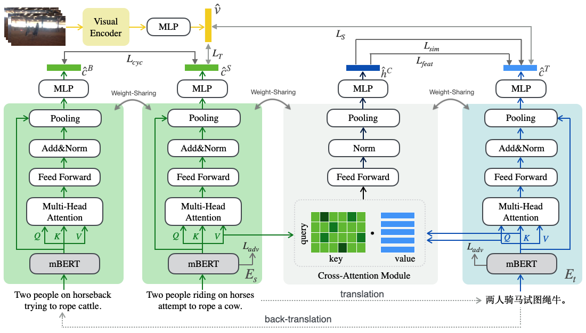

# Cross-Lingual Cross-Modal Retrieval with Noise-Robust Learning

source code of our paper [Cross-Lingual Cross-Modal Retrieval with Noise-Robust Learning](#)




## Table of Contents

* [Environments](#environments)
* [Required Data](#required-data)
* [NRCCR on VATEX](#NRCCR-on-VATEX)
  * [Model Training and Evaluation](#model-training-and-evaluation)
  * [Evaluation using Provided Checkpoints](#Evaluation-using-Provided-Checkpoints)
  * [Expected Performance](#Expected-Performance)
* [NRCCR on MSRVTT10K-CN](#NRCCR-on-MSRVTT10K-CN)
  * [Model Training and Evaluation](#model-training-and-evaluation-1)
  * [Expected Performance](#Expected-Performance-1)
* [NRCCR on Multi-30K](#NRCCR-on-Multi-30K)
  * [Model Training and Evaluation](#model-training-and-evaluation-2)
  * [Expected Performance](#Expected-Performance-2)
* [Reference](#Reference)


## Environments

- CUDA 11.3
- Python 3.8.5
- PyTorch 1.10.2

We used Anaconda to setup a deep learning workspace that supports PyTorch. Run the following script to install the required packages.

```shell
conda create --name nrccr_env python=3.8.5
conda activate nrccr_env
git clone https://github.com/LiJiaBei-7/nrccr.git
cd nrccr
pip install -r requirements.txt
conda deactivate
```


## Required Data

We use three public datasets: VATEX, MSR-VTT-CN, and Multi-30K. The extracted feature is placed  in `$HOME/VisualSearch/`.

<table>
  <tr align="center">
    <th>Dataset</th><th>feature</th><th>caption</th>
  </tr>  
  <tr align='center'>
    <td>VATEX</td>
    <td><a href='https://pan.baidu.com/s/1lg23K93lVwgdYs5qnTuMFg#list/path=%2Fsharelink3222141211-996753374765216%2FTPAMI2021_hybrid_space&parentPath=%2Fsharelink3222141211-996753374765216'>vatex-i3d.tar.gz, pwd:c3p0</a></td>
    <td><a href='https://www.aliyundrive.com/s/xDrzCDNEHWP'>vatex_caption, pwd:oy27</a></td>
  </tr>
  <tr align="center">
    <td>MSR-VTT-CN</td>
    <td><a href='https://pan.baidu.com/s/1lg23K93lVwgdYs5qnTuMFg#list/path=%2Fsharelink3222141211-996753374765216%2FTPAMI2021_hybrid_space&parentPath=%2Fsharelink3222141211-996753374765216'>msrvtt10k-resnext101_resnet152.tar.gz, pwd:c3p0</a></td>
    <td><a href='https://www.aliyundrive.com/s/3sBNJqfTxcp'>cn_caption, pwd:oy27</a></td>
  </tr>
  <tr align="center">
    <td>Multi-30K</td>
    <td><a href='https://pan.baidu.com/s/1AzTN6rFyabirACVkVEVKCQ'>multi30k-resnet152.tar.gz, pwd:5khe</a></td>
    <td><a href='https://www.aliyundrive.com/s/zGEbQAvqHGy'>multi30k_caption, pwd:oy27</a></td>
  </tr>
</table>

```shell
ROOTPATH=$HOME/VisualSearch
mkdir -p $ROOTPATH && cd $ROOTPATH

# download the data of VATEX
mkdir vatex && cd vatex
mkdir TextData
mkdir FeatureData && cd FeatureData
tar zxf <feat-Name>.tar.gz

# download the data of msrvtt10kcn
mkdir msrvtt10kcn && cd msrvtt10kcn
mkdir TextData
mkdir FeatureData && cd FeatureData
tar zxf <feat-Name>.tar.gz

# download the data of multi30k
mkdir multi30k && cd multi30k
mkdir TextData
mkdir FeatureData && cd FeatureData
tar zxf <feat-Name>.tar.gz

# <feat-Name> is corresponding feature name
```


## NRCCR on VATEX


### Model Training and Evaluation

Run the following script to train and evaluate `NRCCR` network. Specifically, it will train `NRCCR` network and select a checkpoint that performs best on the validation set as the final model. Notice that we only save the best-performing checkpoint on the validation set to save disk space.

```shell
ROOTPATH=$HOME/VisualSearch

conda activate nrccr_env

# To train the model on the MSR-VTT, which the feature is resnext-101_resnet152-13k 
# Template:
./do_all_vatex.sh $ROOTPATH <gpu-id>

# Example:
# Train NRCCR 
./do_all_msrvtt.sh $ROOTPATH 0
```

`<gpu-id>` is the index of the GPU where we train on.


### Evaluation using Provided Checkpoints


### Expected Performance


## NRCCR on MSR-VTT-CN


### Model Training and Evaluation

Run the following script to train and evaluate `NRCCR` network on MSR-VTT-CN.

```shell
ROOTPATH=$HOME/VisualSearch

conda activate nrccr_env

# To train the model on the VATEX
./do_all_msrvttcn.sh $ROOTPATH <gpu-id>
```


### Expected Performance


## NRCCR on Multi-30K


### Model Training and Evaluation

Run the following script to train and evaluate `NRCCR` network on Multi-30K.

```shell
ROOTPATH=$HOME/VisualSearch

conda activate nrccr_env

# To train the model on the VATEX
./do_all_multi30k.sh $ROOTPATH <gpu-id>
```


### Expected Performance


## Reference


